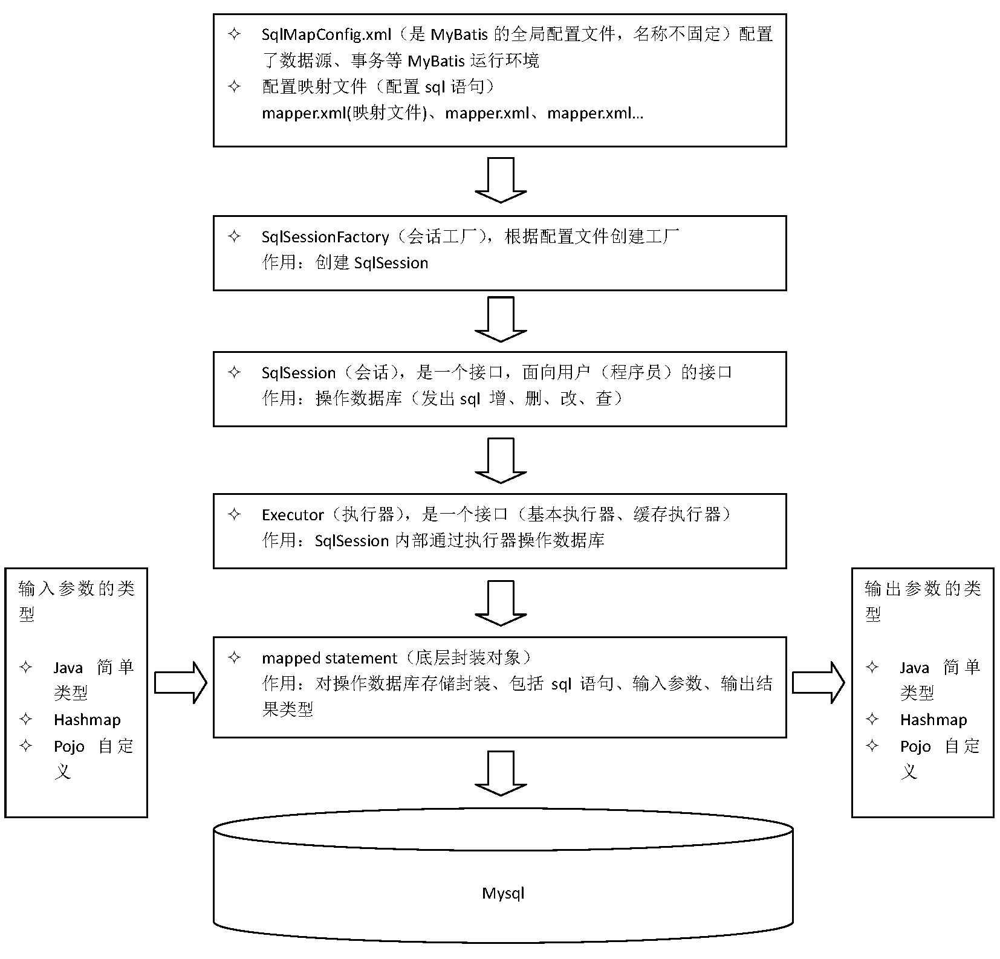

# 001.MyBatis框架原理

## 一、MyBatis是什么？

MyBatis是一个持久层框架，是Apache下的顶级项目。
目前托管在Github https://github.com/mybatis/mybatis-3

MyBatis让程序员将主要精力放在sql上，通过MyBatis提供的映射方法，自由灵活生成（半自动化，大部分需要程序员编写sql）满足需求的sql语句。

MyBatis可以向preparedStatment中传入参数自动进行输入映射，将查询结果集灵活映射成Java对象（输出映射）。

## 二、MyBatis框架

