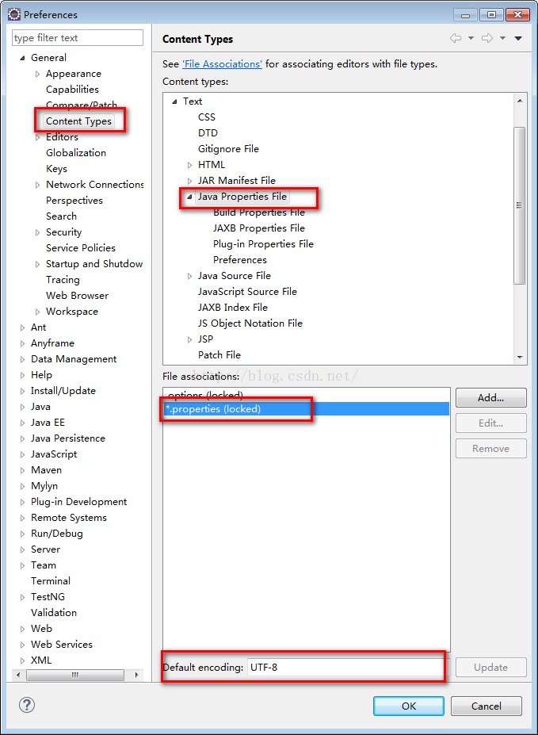
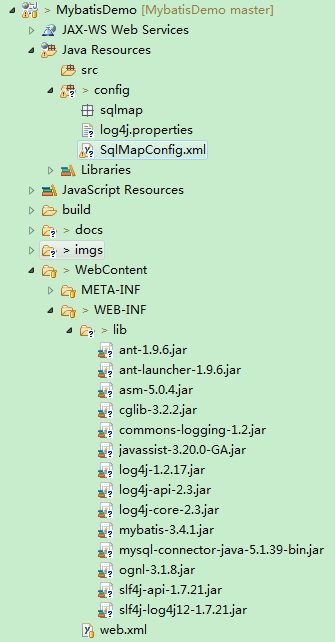

# 002.入门程序

## 一、需求

* 根据用户id（主键）查询用户信息

* 根据用户名称模糊查询用户信息

* 添加用户

* 删除用户

* 更新用户

## 二、环境

* mybatis-3.4.1.jar

* ant-1.9.6.jar
* ant-launcher-1.9.6.jar
* asm-5.0.4.jar
* cglib-3.2.2.jar
* commons-logging-1.2.jar
* javassist-3.20.0-GA.jar
* log4j-1.2.17.jar
* log4j-api-2.3.jar
* log4j-core-2.3.jar
* ognl-3.1.8.jar
* slf4j-api-1.7.21.jar
* slf4j-log4j12-1.7.21.jar

* mysql-connector-java-5.1.39-bin.jar

## 三、log4j.properties

* 从Mybatis用户指南（p90）中拷贝log4j.properties的配置

		# Global logging configuration
		# 开发环境下日志级别设置为DEBUG
		# 生产环境下日志级别设置为INFO或ERROR
		log4j.rootLogger=DEBUG, stdout
		# MyBatis logging configuration...
		log4j.logger.org.mybatis.example.BlogMapper=TRACE
		# Console output...
		log4j.appender.stdout=org.apache.log4j.ConsoleAppender
		log4j.appender.stdout.layout=org.apache.log4j.PatternLayout
		log4j.appender.stdout.layout.ConversionPattern=%5p [%t] - %m%n

* properties文件显示中文问题

## 四、工程结构

## 五、SqlMapConfig.xml

		<?xml version="1.0" encoding="UTF-8" ?>
		<!DOCTYPE configuration
		PUBLIC "-//mybatis.org//DTD Config 3.0//EN"
		"http://mybatis.org/dtd/mybatis-3-config.dtd">
		<configuration>
			<!-- 和spring整合后 environments配置将废除-->
			<environments default="development">
				<environment id="development">
				<!-- 使用jdbc事务管理，由MyBatis控制事务-->
					<transactionManager type="JDBC" />
				<!-- 数据库连接池，由MyBatis管理  -->
					<dataSource type="POOLED">
						<property name="driver" value="com.mysql.jdbc.Driver" />
						<property name="url" value="jdbc:mysql://localhost:3306/mybatis?characterEncoding=utf-8" />
						<property name="username" value="root" />
						<property name="password" value="mysql" />
					</dataSource>
				</environment>
			</environments>	
		</configuration>

## 六、根据用户id（主键）查询用户信息

### 1.创建po类

### 2.映射文件

* 映射文件命名：

User.xml(原iBatis命名)，

mapper代理开发映射文件名称叫XXXMapper.xml，比如：UserMapper.xml、ItemsMapper.xml

在映射文件中配置sql语句。

		<?xml version="1.0" encoding="UTF-8" ?>
		<!DOCTYPE mapper
		PUBLIC "-//mybatis.org//DTD Mapper 3.0//EN"
		"http://mybatis.org/dtd/mybatis-3-mapper.dtd">
		<!-- 
			namespace命名空间，作用就是对sql进行分类话管理
			注意：使用mapper代理方式开始，namespace就有特殊重要的作用
		-->
		<mapper namespace="test">
			<!-- 
				在映射文件中配置很多sql语句
				通过select执行数据库查询
				id：用来标识映射文件中的sql，
					将sql语句封装到mappedStatement对象中，称为statement的id
				parameterType：指定输入参数类型，这里指定int型
				#{}表示一个占位符
				#{id}其中的id用来接收输入的参数，参数名就是id，
					如果输入参数是简单类型，#{}中的参数名可以任意，
				resultType：指定sql输出结果所映射的Java对象类型，这里查询得到的单条记录会映射成java对象
			-->
			<select id="findUserById" parameterType="int" resultType="com.jimmy.mybatis.po.User">
				SELECT * FROM USER WHERE id = #{id}
			</select>
		</mapper>

### 3.在SqlMapConfig.xml中加载User.xml映射文件

		<!-- 加载映射文件 -->
		<mappers>
			<mapper resource="sqlmap/User.xml"/>
		</mappers>

### 4.程序编写

		package com.jimmy.mybatis.first;
		
		import java.io.IOException;
		import java.io.InputStream;
		
		import org.apache.ibatis.io.Resources;
		import org.apache.ibatis.session.SqlSession;
		import org.apache.ibatis.session.SqlSessionFactory;
		import org.apache.ibatis.session.SqlSessionFactoryBuilder;
		import org.junit.Test;
		
		import com.jimmy.mybatis.po.User;
		
		public class MyBatisFirst {
		
			//根据id查询用户信息，得到一条记录
			@Test
			public void findUserByIdTest() throws IOException {
				
				//MyBatis的配置文件
				InputStream inputStream = Resources.getResourceAsStream("SqlMapConfig.xml");
				
				//创建会话工厂SqlSessionFactory，需要传入MyBatis的配置文件信息
				SqlSessionFactory sqlSessionFactory = new SqlSessionFactoryBuilder().build(inputStream);
				
				//通过会话工厂得到会话SqlSession
				SqlSession sqlSession = sqlSessionFactory.openSession();
				
				//通过会话操作数据库
				//第一个参数：映射文件中statement的id，等于namespace.statement的id
				//第二个参数：指定与映射文件中parameterType类型相匹配的的参数
				//sqlSession.selectOne应该返回与映射文件中resultType类型相匹配的对象
				User user = sqlSession.selectOne("test.findUserById", 1);
				
				System.out.println(user);
				
				//释放资源
				sqlSession.close();
			}
		
		}

