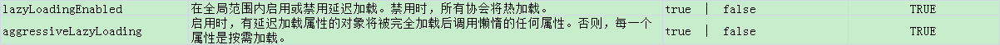

# 010.延迟加载

## 一、什么是延迟加载

先从单表查询，需要时再从关联表查询，大大提高数据库性能，因为查询单表要比关联查询多张表速度快。

## 二、使用association实现延迟加载

### 1.需求

查询订单并且关联查询用户信息

### 2.mapper.xml

需要定义两个mapper接口方法对应的statement

1.只查询订单信息

SELECT * FROM orders

在查询订单的statement中使用<association>去延迟加载下面的statement

		<resultMap type="Orders" id="orderUserLLResultMap">
			<!-- 订单信息 -->
			<id column="id" property="id"/>
			<result column="user_id" property="user_id"/>
			<result column="number" property="number"/>
			<result column="createtime" property="createtime"/>
			<result column="note" property="note"/>
			<!-- 
				用户信息延迟加载
				select：指定延迟加载需要执行的statement的id
				column：订单信息中关联查询用户信息所关联的列user_id
			 -->
			<association property="user" javaType="com.jimmy.mybatis.po.User" 
				select="com.jimmy.mybatis.mapper.UserMapper.findUserById" column="user_id">
			</association>
		</resultMap>
		
		<!-- 查询订单关联查询用户，用户信息需要延迟加载 -->
		<select id="findOrderUserLL" resultMap="orderUserLLResultMap">
			SELECT * FROM orders
		</select>

2.关联查询用户信息

通过上边查到的订单信息中的user_id去关联查询用户信息

		<select id="findUserById" parameterType="int" resultType="user">
			SELECT * FROM USER WHERE id = #{id}
		</select>

### 3.延迟加载配置

在mybatis核心配置文件中配置：

lazyLoadingEnabled：设置为true全局开启延迟加载。

aggressiveLazyLoading：设置为false延迟加载属性将按需加载

<settings>
		<setting name="lazyLoadingEnabled" value="true"/>
		<setting name="aggressiveLazyLoading" value="false"/>
</settings>
