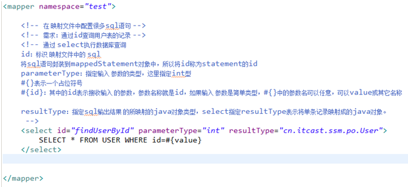
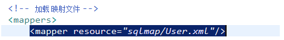
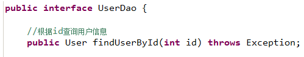
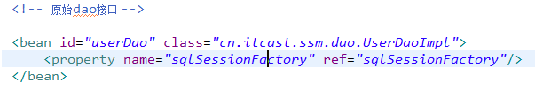

# 012.Spring和MyBatis整合

## 一、整合思路

* 需要Spring通过单例方式管理SqlSessionFactory

* Spring和MyBatis整合生成Mapper代理对象，使用SqlSessionFactory创建SqlSession。（框架自动完成）

* 持久层的Mapper需要由Spring进行管理

## 二、环境配置

MyBatis jar包

	ant-1.9.6.jar
	ant-launcher-1.9.6.jar
	asm-5.0.4.jar
	cglib-3.2.2.jar
	commons-logging-1.2.jar
	ehcache-core-2.6.8.jar
	javassist-3.20.0-GA.jar
	log4j-1.2.17.jar
	log4j-api-2.3.jar
	log4j-core-2.3.jar
	mybatis-3.4.1.jar
	mybatis-ehcache-1.0.3.jar
	mysql-connector-java-5.1.39-bin.jar
	ognl-3.1.8.jar
	slf4j-api-1.7.21.jar
	slf4j-log4j12-1.7.21.jar

Spring jar包

	aspectjweaver.jar
	c3p0-0.9.5.2.jar
	commons-logging-1.2.jar
	mchange-commons-java-0.2.11.jar
	mysql-connector-java-5.1.39-bin.jar
	spring-aop-4.3.3.RELEASE.jar
	spring-aspects-4.3.3.RELEASE.jar
	spring-beans-4.3.3.RELEASE.jar
	spring-context-4.3.3.RELEASE.jar
	spring-core-4.3.3.RELEASE.jar
	spring-expression-4.3.3.RELEASE.jar
	spring-jdbc-4.3.3.RELEASE.jar
	spring-tx-4.3.3.RELEASE.jar

MyBatis-Spring整合包

	mybatis-spring-1.3.0.jar

http://mvnrepository.com/artifact/org.mybatis/mybatis-spring

http://www.mybatis.org/spring/

## 三、SqlSessionFactory

在applicationContext.xml配置sqlSessionFactory

		<!-- 加载属性文件 -->
		<context:property-placeholder location="classpath:db.properties"/>
		
		<!-- 数据源 -->
		<bean id="dataSource" class="com.mchange.v2.c3p0.ComboPooledDataSource">
			<property name="user" value="${jdbc:user}"></property>
			<property name="password" value="${jdbc:password}"></property>
			<property name="driverClass" value="${jdbc:driver}"></property>
			<property name="jdbcUrl" value="${jdbc:url}"></property>
			
			<property name="initialPoolSize" value="${jdbc:initialPoolSize}"></property>
			<property name="maxPoolSize" value="${jdbc:maxPoolSize}"></property>
		</bean>
	
		<!-- sqlSessionFactory -->
		<bean id="sqlSessionFactory" class="org.mybatis.spring.SqlSessionFactoryBean">
			<!-- 加载MyBatis配置文件 -->
			<property name="configLocation" value="SqlMapConfig.xml"></property>
			<property name="dataSource" ref="dataSource"></property>
		</bean>

## 四、原始dao开发（和Spring整合后）

### 1.配置Mapper映射文件User.xml及statement

在SqlMapconfig.xml中加载Mapper映射文件User.xml

### 2.dao接口及其实现类(实现类继承SqlSessionDaoSupport)

让实现类UserDaoImpl继承SqlSessionDaoSupport，并通过Spring注入SqlSessoinFactory

### 3.在applicationContext.xml中配置dao

## 五、mapper代理方式（和Spring整合后）

### 1.mapper映射文件和mapper接口

...

### 2.通过MapperFactoryBean创建mapper接口代理对象

		<!-- 通过MapperFactoryBean创建mapper接口代理对象 -->
		<bean id="userMapper" class="org.mybatis.spring.mapper.MapperFactoryBean">
			<property name="mapperInterface" value="com.jimmy.mybatis.mapper.UserMapper"></property>
			<property name="sqlSessionFactory" ref="sqlSessionFactory"></property>
		</bean>

此方法问题：需要针对每个mapper进行配置，麻烦。

### 3.通过MapperScannerConfigurer进行mapper扫描（建议使用）

		<!-- 
			Mapper批量扫描配置，从mapper包中扫描出mapper接口，自动创建代理对象并在Spring容器中注册
			遵循一些规范：
					使用mapper代理方式开发dao
					mapper接口类名和mapper.xml映射文件名保持一致，且在同一个目录中
			扫描出来的mapper bean的id就是mapper接口名（首字母小写）
			注意：SqlMapConfig.xml中不用再加载或批量加载mapper映射文件		
		 -->
		<bean class="org.mybatis.spring.mapper.MapperScannerConfigurer">
			<!-- 
				指定扫描的包
				如果扫描多个包，中间用逗号分隔
			 -->
			<property name="basePackage" value="com.jimmy.mybatis.mapper"></property>
			<property name="sqlSessionFactoryBeanName" value="sqlSessionFactory"></property>
		</bean>

